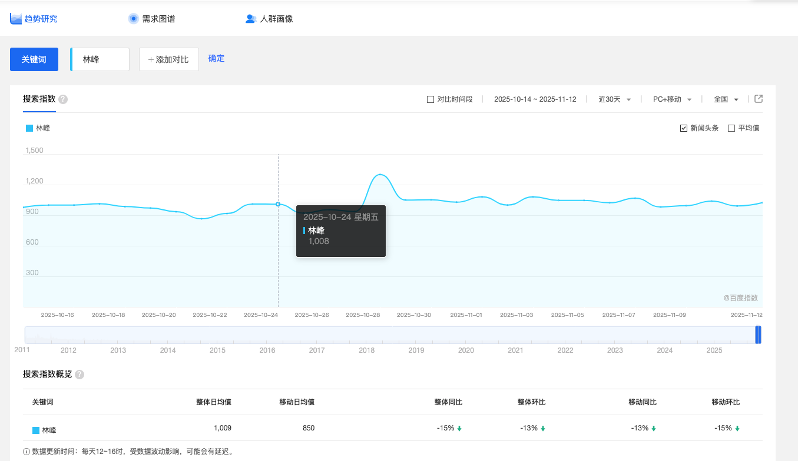

# 使用OCR技术对canvas图像分析爬取关键信息
一般我们使用脚本爬取网页信息有两种方式
* 通过html节点来获取文本节点拿到关键数据信息
* 通过拦截接口响应体获取关键数据信息

但是有一种情况网页使用canvas绘制图表的信息我们无法从html节点获取,接口也经过了加密,我们难以破解这个时候我们应该怎么去处理,针对上述情况我想到了核心为OCR技术的方式,具体步骤通过移动节点->截图->OCR分析来获取



## 场景
* 接口加密的canvas图像网页

## 痛点
* 无法通过html文本节点获取
* 无法通过接口响应体获取

## 解决方法
* 移动节点
* 截图
* OCR分析
* worker多线程加快效率

## 视频展示效果

<Xgplayer url="/mp4/recording.webm"  id="mse" />


## 实战代码展示
```js
// ==UserScript==
// @name         百度指数图表数据抓取器 ocr
// @namespace    http://tampermonkey.net/
// @version      2.0
// @description  优化版百度指数数据抓取工具，支持自动识别图表数据并导出CSV，提供直观的用户界面和状态反馈
// @author       You
// @match        https://index.baidu.com/*
// @grant        GM_xmlhttpRequest
// @grant        GM_download
// @grant        window.focus
// @require      https://cdn.jsdelivr.net/npm/jquery@3.6.0/dist/jquery.min.js
// @require      https://cdn.jsdelivr.net/npm/tesseract.js@4.1.1/dist/tesseract.min.js
// @require      https://html2canvas.hertzen.com/dist/html2canvas.min.js
// ==/UserScript==

(function() {
  'use strict';

  // 全局配置和状态变量
  const config = {
    maxRetryAttempts: 2,
    checkInterval: 500,
    maxWaitTime: 30000,
    chartMargin: 30,
    baseDelay: 300,
    tooltipDelay: 400,
    retryDelay: 600
  };

  // 全局状态变量
  let statusElement = null;
  let dataScraped = 0;
  let totalDataPoints = 30;
  let progressElement = null;
  let dataPreviewModal = null;
  let isScraping = false;
  let tesseractWorker = null; // 可重用的Tesseract WebWorker实例

  // 主函数，开始抓取数据 - 针对百度指数优化
  async function startDataScraping() {
    if (isScraping) {
      showStatus('抓取正在进行中，请稍后再试', 'warning');
      return;
    }

    isScraping = true;
    dataScraped = 0;
    showStatus('开始抓取百度指数图表数据', 'info');
    updateProgress(0);

    // 初始化Tesseract WebWorker（可重用实例）
    showStatus('准备OCR识别环境...', 'info');
    console.log('📦 初始化Tesseract WebWorker实例...');

    try {
      // 使用Tesseract.js v4.x的API创建Worker
      tesseractWorker = await Tesseract.createWorker({
        logger: m => {
          if (m.status === 'loading tesseract core') {
            showStatus('加载OCR核心引擎...', 'info');
            console.log(`⚙️  ${m.status} - ${Math.round(m.progress * 100)}%`);
          } else if (m.status === 'initializing tesseract') {
            showStatus('初始化OCR引擎...', 'info');
            console.log(`⚙️  ${m.status} - ${Math.round(m.progress * 100)}%`);
          } else if (m.status === 'loading language traineddata') {
            showStatus('加载语言包...', 'info');
            console.log(`⚙️  ${m.status} - ${Math.round(m.progress * 100)}%`);
          } else if (m.status === 'ready') {
            showStatus('OCR环境准备完成，开始抓取数据', 'success');
            console.log(`✅  Tesseract WebWorker准备就绪`);
          }
        },
        workerPath: 'https://cdn.jsdelivr.net/npm/tesseract.js@4.1.1/dist/worker.min.js',
        langPath: 'https://cdn.jsdelivr.net/npm/tesseract.js@4.1.1/lang-data/',
        corePath: 'https://cdn.jsdelivr.net/npm/tesseract.js-core@4.0.4/tesseract-core.wasm.js'
      });

      // 设置语言和参数
      await tesseractWorker.loadLanguage('chi_sim+eng');
      await tesseractWorker.initialize('chi_sim+eng');
      await tesseractWorker.setParameters({
        tessedit_char_whitelist: '0123456789-年月日星期一二三四五六日',
        tessedit_pageseg_mode: 7, // 单行文本模式
        preserve_interword_spaces: 0,
        oem: 1 // 使用LSTM引擎
      });

      // 添加isReady标记
      tesseractWorker.isReady = true;
      console.log('✅ Tesseract WebWorker初始化完成并设置为就绪状态');
    } catch (workerInitError) {
      console.error('❌ Tesseract WebWorker初始化失败:', workerInitError);
      showStatus('WebWorker初始化失败，回退到单线程模式', 'warning');
      tesseractWorker = null; // 初始化失败时使用单线程模式
    }

    try {
      // 等待图表加载完成
      const chartLoaded = await waitForChartLoad();
      if (!chartLoaded) {
        showStatus('图表加载失败，请刷新页面后重试', 'error');
        return;
      }

      // 尝试获取百度指数图表容器和canvas
      let canvas = null;
      let chartContainer = null;

      // 百度指数特定查找 - 首先查找指数趋势图表容器
      chartContainer = document.querySelector('.index-trend-chart');
      if (chartContainer) {
        console.log('找到百度指数图表容器');
        // 在容器内查找canvas
        canvas = chartContainer.querySelector('div[style*="position: relative"] canvas');
        if (canvas) {
          console.log('在图表容器内找到canvas元素');
        }
      }

      // 如果没有找到，尝试其他常见的canvas查找方法
      if (!canvas) {
        // 方法1: 直接查找canvas元素
        canvas = document.querySelector('canvas');
        if (canvas) {
          console.log('直接找到canvas元素');
        } else {
          // 方法2: 在常见图表容器中查找canvas
          const commonContainers = ['.chart', '.highcharts-container', '.echarts-container'];
          for (const containerSelector of commonContainers) {
            const container = document.querySelector(containerSelector);
            if (container) {
              canvas = container.querySelector('canvas');
              if (canvas) {
                console.log(`在${containerSelector}中找到canvas元素`);
                break;
              }
            }
          }
        }

        // 方法3: 如果还是没找到，查找所有canvas元素并按大小过滤
        if (!canvas) {
          const canvases = document.querySelectorAll('canvas');
          if (canvases.length > 0) {
            // 按面积排序，选择最大的canvas
            const sortedCanvases = Array.from(canvases).sort((a, b) => {
              const areaA = (a.width || 0) * (a.height || 0);
              const areaB = (b.width || 0) * (b.height || 0);
              return areaB - areaA;
            });
            canvas = sortedCanvases[0];
            console.log('找到最大的canvas元素作为图表');
          } else {
            console.error('无法找到任何canvas元素');
            alert('无法找到图表元素，请确保图表已正确加载');
            return;
          }
        }
      }

      console.log('找到图表canvas，开始分析...');

      // 获取canvas的实际尺寸
      const rect = canvas.getBoundingClientRect();
      const chartWidth = rect.width || canvas.offsetWidth || canvas.width;
      const chartHeight = rect.height || canvas.offsetHeight || canvas.height;

      if (chartWidth <= 10 || chartHeight <= 10) {
        console.error('图表尺寸无效，可能未完全加载');
        alert('图表尺寸无效，请确保图表已完全加载');
        return;
      }

      // 获取图表的实际位置信息
      const canvasPosition = canvas.getBoundingClientRect();
      console.log(`图表尺寸: ${chartWidth}x${chartHeight}, 位置: (${canvasPosition.left}, ${canvasPosition.top})`);

      // 存储结果
      const results = [];
      let successCount = 0;
      const failedAttempts = {}; // 记录失败的天数，用于重试

      // 计算鼠标移动的间隔，确保覆盖整个图表宽度
      const margin = 20; // 百度指数图表左右边距通常较大
      const usableWidth = chartWidth - (margin * 2);
      // 优化dailyWidth计算，确保覆盖从第一个数据点到最后一个数据点的完整范围
      // 使用30个数据点而不是29个间隔，这样可以确保最后一个点不会超出边界
      let dailyWidth = Math.max(2, usableWidth / 30);

      // 确保dailyWidth不为0或过小
      if (dailyWidth <= 0 || !isFinite(dailyWidth)) {
        console.error('计算的日宽度无效，使用默认值15px');
        dailyWidth = 15;
      }

      console.log(`每天宽度: ${dailyWidth}px, 边距: ${margin}px`);

      // 先进行一次完整的数据收集，不再限制为30个点，而是基于图表实际宽度计算合理的点数
      // 计算理想的数据点数量，基于图表宽度和每日宽度
      // 额外增加3-5个数据点以确保完整性
      // 固定数据点数量为30个
      const idealDataPoints = 35;
      console.log(`固定数据点数量: ${idealDataPoints}个`);

      for (let dayIndex = 0; dayIndex < idealDataPoints; dayIndex++) {
        try {
          console.log(`处理第${dayIndex + 1}/${idealDataPoints}个数据点...`);

          // 计算当前x坐标（从左到右）
          // 针对临界点的特殊处理
          let x;

          // 对于第一个点，使用标准位置（不再预先偏移）
          if (dayIndex === 0) {
            console.log(`第一个数据点，使用标准位置`);
            x = 1;
          }
          // 对于最后一个点，使用标准位置（不再预先偏移）
          else if (dayIndex === idealDataPoints - 1) {
            x = margin + (dayIndex * dailyWidth)-5;
            console.log(`最后一个数据点，使用位置: ${x}px`);
          }
          // 中间点正常处理
          else {
            x = margin + (dayIndex * dailyWidth);
          }

          console.log(`第${dayIndex + 1}/${idealDataPoints}个数据点x坐标: ${x}px`);

          // 百度指数图表优化：使用多个y坐标尝试，提高成功率
          // 对于临界点，使用更多的y坐标尝试
          let yPositions;
          if (dayIndex === 0 || dayIndex === idealDataPoints - 1) {
            // 临界点使用更多的y坐标组合
            yPositions = [
              chartHeight * 0.5, // 中间位置
              chartHeight * 0.4, // 稍微偏上
              chartHeight * 0.6, // 稍微偏下
              chartHeight * 0.3, // 更偏上
              chartHeight * 0.7  // 更偏下
            ];
            console.log(`临界点使用更多y坐标尝试: ${yPositions.join(', ')}`);
          } else {
            // 中间点使用标准的y坐标组合
            yPositions = [
              chartHeight * 0.5, // 中间位置
              chartHeight * 0.6, // 稍微偏下
              chartHeight * 0.4  // 稍微偏上
            ];
          }

          let foundData = false;

          // 尝试不同的y位置，直到成功获取数据
          for (const y of yPositions) {
            try {
              console.log(`尝试位置: (${x}, ${y})`);

              // 对于第一个点，使用标准位置（不偏移）
              if (dayIndex === 0) {
                console.log('对第一个点使用标准位置');
                await moveMouseToPosition(canvas, x, y);
                await sleep(600);
              }
              // 对于最后一个点，使用特殊策略
              else if (dayIndex === idealDataPoints - 1) {
                // 先快速移动到目标位置
                await moveMouseToPosition(canvas, x, y);
                // 然后微小移动，模拟人手动操作
                await moveMouseToPosition(canvas, x + 1, y);
                await moveMouseToPosition(canvas, x, y);
                // 临界点增加等待时间
                await sleep(600);
              } else {
                // 常规移动
                await moveMouseToPosition(canvas, x, y);
                // 等待tooltip显示 - 百度指数可能需要更长时间
                await sleep(400);
              }

              // 截图并识别数据
              const data = await captureAndRecognizeData(x, dayIndex);

              if (data) {
                // 检查是否已存在相同dayIndex的数据
                const existingIndex = results.findIndex(item => item.dayIndex === dayIndex);
                if (existingIndex >= 0) {
                  // 更新已存在的数据点
                  results[existingIndex] = data;
                } else {
                  // 添加新的数据点
                  results.push(data);
                }
                successCount++;
                console.log(`第${dayIndex + 1}/${idealDataPoints}个数据点抓取成功:`, data);
                foundData = true;
                break;
              }
            } catch (posError) {
              console.warn(`在位置(${x}, ${y})处理数据时出错:`, posError);
            }

            // 不同y位置尝试之间的延迟
            await sleep(200);
          }

          if (!foundData) {
            console.log(`第${dayIndex + 1}天数据抓取失败，未获取到有效数据，将稍后重试`);
            failedAttempts[dayIndex] = true; // 记录失败的索引以便重试
          }

          // 更新进度
          const progress = Math.round(((dayIndex + 1) / idealDataPoints) * 100);
          updateProgress(progress);
          showStatus(`抓取进度: ${dayIndex + 1}/${idealDataPoints} (${progress}%) - 已成功: ${successCount}个`, 'info');

          // 避免过于频繁的操作
          await sleep(300);
        } catch (error) {
          console.error(`处理第${dayIndex + 1}天数据时出错:`, error);
          failedAttempts[dayIndex] = true; // 记录失败的索引以便重试
        }
      }

      // 特殊处理函数：获取第一个数据点（向右偏移2px）
      async function getFirstPoint() {
        const dayIndex = 0;
        const x = margin;
        const xOffset = x + 2; // 向右偏移2px
        const y = chartHeight / 2;

        // 先移动到偏移位置
        await moveMouseToPosition(canvas, xOffset, y);
        await sleep(600);

        // 捕获并识别数据
        const data = await captureAndRecognizeData(x, dayIndex);

        if (data) {
          console.log(`成功捕获第一个点数据(偏移处理): ${data.date} - ${data.value}`);
          return data;
        }

        return null;
      }

      // 特殊处理函数：获取最后一个数据点（向左偏移2px）
      async function getLastPoint() {
        const dayIndex = idealDataPoints - 1;
        const x = margin + (dayIndex * dailyWidth);
        const xOffset = x - 2; // 向左偏移2px
        const y = chartHeight / 2;

        // 先移动到偏移位置
        await moveMouseToPosition(canvas, xOffset, y);
        await sleep(600);

        // 捕获并识别数据
        const data = await captureAndRecognizeData(x, dayIndex);

        if (data) {
          console.log(`成功捕获最后一个点数据(偏移处理): ${data.date} - ${data.value}`);
          return data;
        }

        return null;
      }

      // 检测是否缺失首尾点的函数
      function checkMissingPoints(data) {
        // 从数据中提取所有日期
        const dates = data.map(point => point.date);

        // 尝试确定第一个和最后一个预期日期
        const today = new Date();
        const lastExpectedDay = new Date(today);
        lastExpectedDay.setDate(today.getDate() - 1); // 昨天

        const firstExpectedDay = new Date(today);
        firstExpectedDay.setDate(today.getDate() - 30); // 30天前

        // 格式化日期为YYYY-MM-DD
        const formatDate = (date) => {
          const year = date.getFullYear();
          const month = String(date.getMonth() + 1).padStart(2, '0');
          const day = String(date.getDate()).padStart(2, '0');
          return `${year}-${month}-${day}`;
        };

        const lastExpectedDate = formatDate(lastExpectedDay);
        const firstExpectedDate = formatDate(firstExpectedDay);

        console.log(`预期第一个日期: ${firstExpectedDate}, 预期最后一个日期: ${lastExpectedDate}`);

        // 检查是否包含预期的首尾日期
        const hasFirstDay = dates.some(date => date && date.includes(firstExpectedDate));
        const hasLastDay = dates.some(date => date && date.includes(lastExpectedDate));

        return {
          missingFirst: !hasFirstDay,
          missingLast: !hasLastDay,
          firstExpectedDate,
          lastExpectedDate
        };
      }

      // 按dayIndex排序数据点
      results.sort((a, b) => a.dayIndex - b.dayIndex);

      // 检查原始数据点数量，确保有足够的数据进行去重
      console.log(`抓取完成，原始数据点数量: ${results.length}`);

      // 如果原始数据点数量小于30，显示警告
      if (results.length < 30) {
        console.warn(`⚠️  原始数据点数量不足30个，仅${results.length}个，可能需要重新抓取`);
      }

      // 基于日期值进行去重
      const uniqueResults = [];
      const seenDates = new Set();

      // 检测缺失的首尾点并执行特殊处理
      const missingPoints = checkMissingPoints(results);

      // 如果缺失首尾点，执行特殊处理
      if (missingPoints.missingFirst || missingPoints.missingLast) {
        console.log('检测到缺失首尾点，执行特殊处理');
        showStatus('检测到缺失首尾点，执行偏移处理...', 'info');

        // 处理缺失的第一个点
        if (missingPoints.missingFirst) {
          console.log(`执行第一个点的特殊偏移处理，预期日期: ${missingPoints.firstExpectedDate}`);
          const firstPointData = await getFirstPoint();
          if (firstPointData) {
            // 如果数据不存在于uniqueResults中，则添加
            if (!uniqueResults.some(p => p.date === firstPointData.date)) {
              uniqueResults.push(firstPointData);
              console.log('成功添加第一个点');
              successCount++;
            }
          }
        }

        // 处理缺失的最后一个点
        if (missingPoints.missingLast) {
          console.log(`执行最后一个点的特殊偏移处理，预期日期: ${missingPoints.lastExpectedDate}`);
          const lastPointData = await getLastPoint();
          if (lastPointData) {
            // 如果数据不存在于uniqueResults中，则添加
            if (!uniqueResults.some(p => p.date === lastPointData.date)) {
              uniqueResults.push(lastPointData);
              console.log('成功添加最后一个点');
              successCount++;
            }
          }
        }
      }

      // 只基于日期进行去重，确保每个日期只保留一个数据点
      for (const item of results) {
        // 确保有有效的日期数据
        const dateStr = item.date || '';

        // 如果日期未见过，则保留该数据点
        if (dateStr && !seenDates.has(dateStr)) {
          // 记录已处理的日期
          seenDates.add(dateStr);

          // 添加到结果中
          uniqueResults.push(item);
          console.log(`去重后保留数据: date=${dateStr}, value=${item.value}`);
        } else if (!dateStr) {
          // 对于没有日期的数据点，可能需要特殊处理
          console.log(`数据点无日期信息: dayIndex=${item.dayIndex}, value=${item.value}`);
          // 可以选择跳过或添加到临时集合
        } else {
          console.log(`去重移除重复日期数据: date=${dateStr}, value=${item.value}`);
        }
      }

      // 按日期字符串排序，确保顺序正确
      uniqueResults.sort((a, b) => {
        // 尝试将日期字符串转换为日期对象进行比较
        const dateA = new Date(a.date);
        const dateB = new Date(b.date);

        // 如果转换成功，则按日期排序
        if (!isNaN(dateA.getTime()) && !isNaN(dateB.getTime())) {
          return dateA.getTime() - dateB.getTime();
        }

        // 否则按字符串比较
        return a.date.localeCompare(b.date);
      });

      console.log(`去重后数据点数量: ${uniqueResults.length}`);

      // 检查是否达到30个数据点（不再自动重新抓取）
      if (uniqueResults.length < 30) {
        console.warn(`⚠️  去重后数据点数量不足30个，仅${uniqueResults.length}个`);
        showStatus(`去重后仅获取到 ${uniqueResults.length} 个数据点`, 'warning');
      }

      updateProgress(100);
      console.log(`✅ 数据抓取完成，去重后共${uniqueResults.length}个数据点，满足要求！`);
      console.log(uniqueResults,'uniqueResults')
      // 显示数据预览
      if (uniqueResults.length > 0) {
        showStatus(`成功抓取 ${uniqueResults.length} 条数据，满足要求！`, 'success');
        showDataPreview(uniqueResults);
        // 自动导出CSV
        exportToCSV(uniqueResults);
      } else {
        console.warn('❌ 未抓取到任何数据');
        showStatus('未抓取到数据，请尝试刷新页面或调整图表显示范围', 'error');
      }
    }
    catch (error) {
      console.error('数据抓取过程中发生严重错误:', error);
      showStatus(`抓取失败: ${error.message || '未知错误'}`, 'error');
    }
    finally {
      isScraping = false;
      updateProgress(100);

      // 注意：这里不要关闭Worker，以便下次重用
      // 如果需要关闭Worker，可以调用 tesseractWorker.terminate()
      console.log('✅ Worker实例保持活跃，可用于下次抓取');
    }
  }

  // 等待图表加载完成
  async function waitForChartLoad() {
    return new Promise(resolve => {
      console.log('等待百度指数图表加载完成...');
      showStatus('正在检测图表是否加载完成', 'info');

      let elapsedTime = 0;
      let intervalId = null; // 提前声明intervalId变量

      // 检查图表是否加载完成的函数
      const checkChartLoaded = () => {
        elapsedTime += config.checkInterval;

        // 如果超过最大等待时间，放弃等待
        if (elapsedTime > config.maxWaitTime) {
          console.warn('❌ 图表加载超时');
          showStatus('图表加载超时，请手动刷新页面后重试', 'error');
          if (intervalId) clearInterval(intervalId);
          resolve(false);
          return;
        }

        // 尝试多种方式检测百度指数图表
        let chartLoaded = false;

        // 方式1: 优先检测百度指数特定的图表容器
        const chartContainer = document.querySelector('.index-trend-chart');
        if (chartContainer) {
          const containerRect = chartContainer.getBoundingClientRect();
          if (containerRect.width > 200 && containerRect.height > 100) {
            // 在容器内查找canvas
            const canvas = chartContainer.querySelector('canvas');
            if (canvas) {
              chartLoaded = true;
              console.log('✓ 检测到百度指数图表容器和canvas元素');
            }
          }
        }

        // 方式2: 检查是否存在有效的canvas元素
        if (!chartLoaded) {
          const canvas = document.querySelector('canvas');
          if (canvas) {
            const rect = canvas.getBoundingClientRect();
            if (rect.width > 300 && rect.height > 200) {
              chartLoaded = true;
              console.log('✓ 检测到有效尺寸的canvas元素');
            }
          }
        }

        // 方式3: 检查图表中的关键元素
        if (!chartLoaded) {
          const potentialCharts = document.querySelectorAll(
            '[_echarts_instance_], [class*="trend-chart"], [class*="index-chart"]'
          );
          for (const el of potentialCharts) {
            const rect = el.getBoundingClientRect();
            if (rect.width > 200 && rect.height > 100) {
              chartLoaded = true;
              console.log('✓ 检测到可能的图表元素');
              break;
            }
          }
        }

        // 如果检测到图表已加载
        if (chartLoaded) {
          if (intervalId) clearInterval(intervalId);
          console.log('✅ 图表加载检测成功');
          showStatus('图表加载完成，准备开始抓取', 'success');
          // 再等待一小段时间确保图表渲染完成
          setTimeout(() => {
            resolve(true);
          }, 1000);
        } else if (elapsedTime % 3000 === 0) { // 每3秒显示一次等待信息
          const waitTime = Math.round(elapsedTime / 1000);
          showStatus(`等待图表加载中... (${waitTime}秒)`, 'info');
        }
      };

      // 立即执行一次检查，然后开始定期检查
      checkChartLoaded();
      intervalId = setInterval(checkChartLoaded, config.checkInterval);
    });
  }

  // 移动鼠标到指定位置 - 针对百度指数优化
  function moveMouseToPosition(element, x, y, isLeftOffset = false) {
    return new Promise(resolve => {
      try {
        // 检查DOM元素是否有效
        if (!element || !(element instanceof Element)) {
          console.error('无效的DOM元素');
          resolve();
          return;
        }

        // 获取元素在页面中的位置
        const rect = element.getBoundingClientRect();

        // 计算相对于页面的全局坐标
        const pageX = rect.left + window.scrollX + x;
        const pageY = rect.top + window.scrollY + y;

        console.log(`移动鼠标到元素相对坐标: (${x}, ${y}), 页面绝对坐标: (${pageX}, ${pageY})`);

        // 百度指数优化策略：尝试多种事件触发方式
        let success = false;

        // 策略1: 尝试使用现代的MouseEvent构造函数（优先使用，不包含view属性）
        try {
          const modernEvent = new MouseEvent('mousemove', {
            bubbles: true,
            cancelable: true,
            clientX: pageX,
            clientY: pageY,
            pageX: pageX,
            pageY: pageY,
            screenX: pageX,
            screenY: pageY
          });

          // 先尝试直接在canvas上触发
          if (element.dispatchEvent(modernEvent)) {
            console.log('策略1成功: 使用现代MouseEvent在canvas上触发事件');
            success = true;
          }
        } catch (e) {
          console.log('策略1失败，尝试策略2:', e.message);
        }

        // 策略2: 如果策略1失败，尝试在canvas的父容器上触发
        if (!success) {
          try {
            const parentEvent = new MouseEvent('mousemove', {
              bubbles: true,
              cancelable: true,
              clientX: pageX,
              clientY: pageY
            });

            if (element.parentElement && element.parentElement.dispatchEvent(parentEvent)) {
              console.log('策略2成功: 在canvas父容器上触发事件');
              success = true;
            }
          } catch (e) {
            console.log('策略2失败，尝试策略3:', e.message);
          }
        }

        // 策略3: 使用传统的createEvent方法（兼容性更好）
        if (!success) {
          try {
            const legacyEvent = document.createEvent('MouseEvents');
            legacyEvent.initMouseEvent(
              'mousemove',
              true,   // bubbles
              true,   // cancelable
              window, // view
              0,      // detail
              pageX, pageY, // screenX, screenY
              pageX, pageY, // clientX, clientY
              false, false, false, false, // ctrlKey, altKey, shiftKey, metaKey
              0,      // button
              null    // relatedTarget
            );

            if (element.dispatchEvent(legacyEvent)) {
              console.log('策略3成功: 使用createEvent在canvas上触发事件');
              success = true;
            }
          } catch (e) {
            console.log('策略3失败，尝试策略4:', e.message);
          }
        }

        // 策略4: 尝试触发多种鼠标事件组合（mousemove, mouseover, mouseenter）
        if (!success) {
          try {
            const eventsToTry = ['mousemove', 'mouseover', 'mouseenter'];

            for (const eventType of eventsToTry) {
              const comboEvent = new MouseEvent(eventType, {
                bubbles: true,
                cancelable: true,
                clientX: pageX,
                clientY: pageY
              });

              if (element.dispatchEvent(comboEvent)) {
                console.log(`策略4成功: 触发${eventType}事件`);
                success = true;
                break;
              }
            }
          } catch (e) {
            console.log('策略4失败:', e.message);
          }
        }

        // 策略5: 直接在document上触发事件（最后手段）
        if (!success) {
          try {
            const docEvent = new MouseEvent('mousemove', {
              bubbles: true,
              cancelable: true,
              clientX: pageX,
              clientY: pageY
            });

            if (document.dispatchEvent(docEvent)) {
              console.log('策略5成功: 在document上触发事件');
              success = true;
            }
          } catch (e) {
            console.log('策略5失败:', e.message);
          }
        }

        // 如果所有策略都失败，尝试修改DOM元素属性（模拟鼠标悬停）
        if (!success) {
          try {
            // 添加临时悬停类
            const tempClass = 'temp-mouseover-simulation';
            element.classList.add(tempClass);

            // 修改元素样式模拟悬停效果
            element.style.cursor = 'pointer';
            element.style.opacity = '0.99'; // 小变化以触发可能的重绘

            // 强制浏览器重绘
            void element.offsetWidth;

            console.log('使用DOM修改模拟鼠标悬停效果');
            success = true;

            // 稍后移除临时类（不阻塞当前流程）
            setTimeout(() => {
              element.classList.remove(tempClass);
              element.style.cursor = '';
              element.style.opacity = '';
            }, 100);
          } catch (e) {
            console.log('DOM修改策略失败:', e.message);
          }
        }

        if (success) {
          // 触发一些额外事件以确保tooltip显示
          try {
            // 尝试触发mouseover和mouseout来强制刷新状态
            const mouseOverEvent = new MouseEvent('mouseover', { bubbles: true });
            element.dispatchEvent(mouseOverEvent);
          } catch (e) {
            console.log('额外事件触发失败，但主操作已成功');
          }
        } else {
          console.error('所有鼠标事件触发策略都失败了');
        }
      } catch (error) {
        console.error('移动鼠标时发生错误:', error.message);
      }
      // 无论成功与否，都继续执行不中断流程
      resolve();
    });
  }

  // 截图并识别数据
  async function captureAndRecognizeData(x, dayIndex) {
    try {
      // 根据用户提供的DOM结构，优先查找百度指数特定的tooltip结构
      let tooltip = null;

      // 方案1: 查找指数趋势图表容器内的tooltip元素
      const chartContainer = document.querySelector('.index-trend-chart');
      if (chartContainer) {
        console.log('找到指数趋势图表容器');

        // 1.1 基于用户提供的DOM结构，查找特定的tooltip模式
        // 查找具有box-shadow、position: absolute和高z-index的元素
        const potentialTooltips = chartContainer.querySelectorAll('div[style*="position: absolute"][style*="box-shadow"]');
        for (const el of potentialTooltips) {
          // 检查元素是否包含日期和数字格式的内容
          const text = el.textContent || el.innerText;
          const hasDatePattern = /\d{4}-\d{2}-\d{2}/.test(text);
          const hasNumberPattern = /\d+/.test(text);

          // 检查可见性
          const computedStyle = window.getComputedStyle(el);
          const isVisible = computedStyle.visibility !== 'hidden' &&
            computedStyle.opacity !== '0' &&
            computedStyle.display !== 'none';

          // 检查是否有多个嵌套div结构（符合百度指数的tooltip特点）
          const nestedDivs = el.querySelectorAll('div').length;

          if (isVisible && (hasDatePattern || hasNumberPattern) && nestedDivs >= 2) {
            tooltip = el;
            console.log('找到百度指数特定结构的tooltip元素');
            console.log('Tooltip内部div数量:', nestedDivs);
            break;
          }
        }

        // 1.2 查找高z-index的tooltip元素
        if (!tooltip) {
          const highZIndexEl = chartContainer.querySelector('div[style*="z-index: 9999999"]');
          if (highZIndexEl && highZIndexEl.textContent.trim() !== '') {
            tooltip = highZIndexEl;
            console.log('找到高z-index的tooltip元素');
          }
        }

        // 1.3 查找echarts实例旁边的tooltip
        if (!tooltip) {
          const echartsInstance = chartContainer.querySelector('[_echarts_instance_]');
          if (echartsInstance) {
            const nextSibling = echartsInstance.nextElementSibling;
            if (nextSibling && nextSibling.tagName === 'DIV') {
              tooltip = nextSibling;
              console.log('找到echarts实例旁边的tooltip元素');
            }
          }
        }
      }

      // 方案2: 如果没找到，尝试使用多种可能的选择器
      if (!tooltip) {
        const tooltipSelectors = [
          'div[style*="position: absolute"][style*="background-color: rgba(0, 0, 0, 0.8)"][style*="border-radius"]', // 特定样式的tooltip
          'div[style*="pointer-events: none"][style*="absolute"][style*="z-index"]', // 不可点击的tooltip
          '.index-trend-chart > div:last-child', // 图表容器的最后一个div
          'div[style*="transform: translate3d"]' // 使用3D变换的元素
        ];

        for (const selector of tooltipSelectors) {
          const elements = document.querySelectorAll(selector);
          for (const el of elements) {
            // 检查元素是否可见且包含数据
            const computedStyle = window.getComputedStyle(el);
            if (computedStyle.visibility !== 'hidden' && computedStyle.opacity !== '0') {
              const text = el.textContent || el.innerText;
              if (text && text.trim().length > 0 &&
                (text.includes('-') || /\d+/.test(text))) {
                tooltip = el;
                console.log(`使用选择器 '${selector}' 找到可见的tooltip元素`);
                break;
              }
            }
          }
          if (tooltip) break;
        }
      }

      console.log('找到的tooltip元素:', tooltip ? tooltip.tagName : '未找到');
      console.log('Tooltip元素HTML结构:', tooltip ? tooltip.outerHTML.substring(0, 500) + '...' : '未找到');

      if (tooltip) {
        // 获取tooltip矩形区域（用于可能的OCR）
        const tooltipRect = tooltip.getBoundingClientRect();
        console.log('Tooltip位置和尺寸:', tooltipRect);

        // 百度指数特定的数据提取逻辑 - 基于提供的DOM结构
        //                 try {
        //                     // 从tooltip中提取日期和数值
        //                     let date = '';
        //                     let value = '';

        //                     // 提取日期 - 通常是第一个div元素
        //                     const dateElement = tooltip.querySelector('div:first-child');
        //                     if (dateElement) {
        //                         date = dateElement.textContent.trim();
        //                         // 清理日期格式，移除星期信息
        //                         if (date.includes('星期')) {
        //                             date = date.split('星期')[0].trim();
        //                         }
        //                         console.log('直接提取的日期:', date);
        //                     }

        //                     // 提取数值 - 查找包含数字的div元素（基于用户提供的结构）
        //                     // 用户提供的结构显示数值在特定的div中：<div style="color: #999;">&nbsp;&nbsp;404</div>
        //                     const valueElements = tooltip.querySelectorAll('div[style*="color: #999"]');
        //                     if (valueElements.length > 0) {
        //                         value = valueElements[valueElements.length-1].textContent
        //                         console.log(valueElements[valueElements.length-1].textContent,'valueElements')
        //                         console.log('从最后一个非空行提取的值:', value);
        //                     }
        //                     // 如果找到了有效数据，直接返回结果
        //                     if (date && value) {
        //                         console.log(`成功从tooltip中提取数据: 日期=${date}, 数值=${value}`);
        //                         return {
        //                             dayIndex,
        //                             date,
        //                             value: value,
        //                             rawText: tooltip.textContent.trim(),
        //                             extractionMethod: 'DOM结构分析'
        //                         };
        //                     }
        //                 } catch (extractionError) {
        //                     console.warn('直接提取数据失败，尝试文本分析:', extractionError);
        //                 }

        // 如果特定提取失败，尝试通用文本分析
        // const directText = tooltip.textContent || tooltip.innerText;
        // if (directText && directText.trim().length > 0) {
        //     console.log('tooltip文本内容:', directText);
        //     const parsedData = parseRecognizedText(directText, dayIndex);
        //     if (parsedData) {
        //         parsedData.extractionMethod = '文本解析';
        //         return parsedData;
        //     }
        // }

        // 如果Tesseract.js可用，使用OCR技术
        if (window.Tesseract && tooltipRect) {
          try {
            // 创建一个canvas来截图tooltip
            const screenshotCanvas = document.createElement('canvas');
            const ctx = screenshotCanvas.getContext('2d');
            screenshotCanvas.width = tooltipRect.width;
            screenshotCanvas.height = tooltipRect.height;

            // 使用html2canvas进行可靠的截图，避免drawImage类型错误
            try {
              if (window.html2canvas && tooltip) {
                console.log('使用html2canvas进行tooltip截图');

                // 使用html2canvas捕获tooltip元素 - 优化scale提高性能
                const tooltipCanvas = await html2canvas(tooltip, {
                  scale: 1.5, // 降低缩放比例以提高性能，同时保持足够清晰度
                  useCORS: true,
                  logging: false,
                  allowTaint: false,
                  backgroundColor: null
                });

                console.log('html2canvas截图成功，准备OCR识别');

                // 使用可重用的WebWorker进行OCR识别
                let result;
                if (tesseractWorker !== null && tesseractWorker.isReady) {
                  console.log(`📌 第${dayIndex + 1}/30个数据点 - 使用可重用WebWorker进行OCR识别`);

                  try {
                    // 使用已初始化的Worker实例
                    // 注意：不要在recognize中传递logger，因为函数无法被序列化
                    result = await tesseractWorker.recognize(
                      tooltipCanvas.toDataURL()
                    );
                    console.log(`✅  WebWorker识别完成`);
                  } catch (workerRecogError) {
                    console.error('WebWorker识别失败，回退到单线程模式:', workerRecogError);
                    // 如果Worker识别失败，回退到单线程模式
                    console.log(`📌 第${dayIndex + 1}/30个数据点 - WebWorker识别失败，回退到单线程OCR识别`);
                    result = await Tesseract.recognize(
                      tooltipCanvas.toDataURL(),
                      'chi_sim+eng',
                      {
                        logger: m => {
                          if (m.status === 'recognizing text') {
                            console.log(`⚙️  单线程识别中 - ${Math.round(m.progress * 100)}%`);
                          } else if (m.status === 'done') {
                            console.log(`✅  单线程识别完成`);
                          }
                        },
                        workerPath: 'https://cdn.jsdelivr.net/npm/tesseract.js@4.1.1/dist/worker.min.js',
                        langPath: 'https://cdn.jsdelivr.net/npm/tesseract.js@4.1.1/lang-data/',
                        corePath: 'https://cdn.jsdelivr.net/npm/tesseract.js-core@4.0.4/tesseract-core.wasm.js',
                        tessedit_char_whitelist: '0123456789-年月日星期一二三四五六日',
                        tessedit_pageseg_mode: 7,
                        preserve_interword_spaces: 0,
                        oem: 1
                      }
                    );
                  }
                } else {
                  // 回退到原始方式（单线程）
                  console.log(`📌 第${dayIndex + 1}/30个数据点 - 使用单线程OCR识别`);
                  result = await Tesseract.recognize(
                    tooltipCanvas.toDataURL(),
                    'chi_sim+eng',
                    {
                      logger: m => {
                        if (m.status === 'recognizing text') {
                          console.log(`⚙️  单线程识别中 - ${Math.round(m.progress * 100)}%`);
                        } else if (m.status === 'done') {
                          console.log(`✅  单线程识别完成`);
                        }
                      },
                      workerPath: 'https://cdn.jsdelivr.net/npm/tesseract.js@4.1.1/dist/worker.min.js',
                      langPath: 'https://cdn.jsdelivr.net/npm/tesseract.js@4.1.1/lang-data/',
                      corePath: 'https://cdn.jsdelivr.net/npm/tesseract.js-core@4.0.4/tesseract-core.wasm.js',
                      tessedit_char_whitelist: '0123456789-年月日星期一二三四五六日',
                      tessedit_pageseg_mode: 7,
                      preserve_interword_spaces: 0,
                      oem: 1
                    }
                  );
                }
                console.log(`📌 第${dayIndex + 1}/30个数据点 - OCR识别完成`);

                // 解析识别结果
                const text = result.data.text.trim();
                console.log('OCR识别结果:', text);
                const parsedData = parseRecognizedText(text, dayIndex);
                if (parsedData) {
                  parsedData.extractionMethod = 'OCR识别';
                  return parsedData;
                }
              } else {
                console.log('html2canvas未加载，尝试备选截图方法');

                // 备选方法：直接获取tooltip文本
                const tooltipText = tooltip ? tooltip.textContent || tooltip.innerText || '' : '';
                if (tooltipText.trim()) {
                  console.log('使用tooltip文本内容作为备选:', tooltipText);
                  const parsedData = parseRecognizedText(tooltipText, dayIndex);
                  if (parsedData) {
                    parsedData.extractionMethod = 'tooltip文本';
                    return parsedData;
                  }
                }
              }
            } catch (screenshotError) {
              console.error('截图或OCR识别失败:', screenshotError);

              // 详细记录错误信息，帮助调试
              if (screenshotError.message && screenshotError.message.includes('TessBaseAPI')) {
                console.error('❌ OCR引擎内部错误 - WebAssembly模块可能未正确加载');
                showStatus('OCR引擎内部错误，尝试直接解析tooltip文本', 'warning');
              } else if (screenshotError.message && screenshotError.message.includes('NetworkError')) {
                console.error('❌ 网络错误 - OCR识别过程中资源加载失败');
                showStatus('网络错误，尝试直接解析tooltip文本', 'warning');
              } else {
                console.error('❌ 未知错误 - 截图或OCR识别过程中发生异常');
                showStatus('截图或OCR识别失败，尝试直接解析tooltip文本', 'warning');
              }

              // 错误后尝试直接获取文本
              try {
                if (tooltip) {
                  const tooltipText = tooltip.textContent || tooltip.innerText || '';
                  if (tooltipText.trim()) {
                    console.log('OCR失败后尝试文本提取:', tooltipText);
                    const parsedData = parseRecognizedText(tooltipText, dayIndex);
                    if (parsedData) {
                      parsedData.extractionMethod = '错误恢复文本提取';
                      return parsedData;
                    }
                  }
                }
              } catch (textError) {
                console.error('文本提取也失败:', textError);
              }
            }

            // 可选：保存截图到控制台以便调试
            // console.log('Tooltip截图:', screenshotCanvas.toDataURL());


          } catch (ocrError) {
            console.error('OCR识别失败:', ocrError);
          }
        }

        console.log('所有数据提取方法均失败');
        return null;
      } else {
        console.log('未找到tooltip元素');

        // 如果没有找到tooltip，尝试直接从canvas提取数据的备选方法
        // 这里可以添加其他数据提取方法

        return null;
      }
    } catch (error) {
      console.error('截图和识别数据时出错:', error);
      return null;
    }
  }

  // 解析识别到的文本 - 针对百度指数格式优化，专注于最后一行数值提取
  function parseRecognizedText(text, dayIndex) {
    try {
      console.log('解析文本:', text);

      // 提取日期 - 针对百度指数特定格式优化
      let date = '';

      // 匹配百度指数日期格式: "2025-11-08 星期六"
      const baiduDateFormat = /(\d{4}-\d{2}-\d{2})\s*星期[一二三四五六日]?/;
      const dateMatch = text.match(baiduDateFormat);
      if (dateMatch) {
        date = dateMatch[1];
        console.log('提取的日期(百度指数格式):', date);
      } else {
        // 尝试标准YYYY-MM-DD格式
        const stdDateMatch = text.match(/(\d{4}-\d{2}-\d{2})/);
        if (stdDateMatch) {
          date = stdDateMatch[1];
          console.log('提取的日期(标准格式):', date);
        } else {
          // 使用相对日期作为后备
          date = `第${dayIndex + 1}天`;
          console.log('使用相对日期:', date);
        }
      }

      // 提取数值 - 专注于最后一行的数值提取（根据用户建议优化）
      let value = null;

      // 按行分割文本
      const lines = text.split('\n').map(line => line.trim()).filter(line => line.length > 0);

      // 只处理最后一行（百度指数数值通常在最后一行）
      if (lines.length > 0) {
        const lastLine = lines[lines.length - 1];
        console.log('最后一行内容:', lastLine);

        // 方案优化：从最后一行提取数值，支持带逗号的格式（如"1,049"）
        // 1. 移除所有非数字字符（包括逗号）
        const cleanedLastLine = lastLine.replace(/[^\d]/g, '');

        if (cleanedLastLine.length > 0) {
          value = parseInt(cleanedLastLine);
          console.log('从最后一行提取的数值:', value);
        } else {
          // 备选方案：检查最后一行是否包含数字序列（可能有空格分隔）
          const numberSequence = lastLine.match(/\d+(?:\s*\d+)*/g);
          if (numberSequence && numberSequence.length > 0) {
            // 清理空格并转换为数字
            const cleanedNumber = parseInt(numberSequence[0].replace(/\s+/g, ''));
            if (!isNaN(cleanedNumber)) {
              value = cleanedNumber;
              console.log('从最后一行数字序列提取的数值:', value);
            }
          }
        }
      }

      // 最终后备方案：如果最后一行提取失败，尝试从整个文本查找可能的数值
      if (value === null || isNaN(value) || value < 0) {
        console.warn('最后一行提取失败，尝试从整个文本查找数值');
        // 查找所有可能的数字序列，支持带逗号的格式
        const allNumbers = text.match(/\d+(?:,\d+)*\b/g);
        if (allNumbers && allNumbers.length > 0) {
          // 清理逗号并转换为数字
          const cleanNumbers = allNumbers.map(num => parseInt(num.replace(/,/g, '')));
          // 过滤有效数字
          const validNumbers = cleanNumbers.filter(num => !isNaN(num) && num > 0 && num < 1000000); // 排除年份和异常值

          if (validNumbers.length > 0) {
            // 选择最后一个有效数字（通常在最后）
            value = validNumbers[validNumbers.length - 1];
            console.log('后备方案提取的数值:', value);
          }
        }
      }

      console.log('最终解析结果 - 日期:', date, '数值:', value);

      return {
        dayIndex,
        date,
        value,
        rawText: text // 保存原始文本以供调试和后续分析
      };
    } catch (error) {
      console.error(`解析文本时出错: ${error.message}`);
      return null;
    }
  }

  // 导出数据为CSV
  function exportToCSV(data) {
    try {
      console.log(`准备导出${data.length}条数据到CSV文件`);

      // 构建CSV内容，添加BOM以支持Excel正确识别UTF-8编码
      let csvContent = "\uFEFF日期,数值,原始文本\n";

      data.forEach(item => {
        // 确保日期中的逗号被正确处理
        const safeDate = item.date.replace(/"/g, '""'); // 转义双引号
        const safeRawText = item.rawText ? item.rawText.replace(/\n/g, ' ').replace(/"/g, '""') : '';
        csvContent += `"${safeDate}",${item.value},"${safeRawText}"\n`;
      });

      // 方法1: 使用Blob和URL.createObjectURL（更可靠）
      try {
        const blob = new Blob([csvContent], { type: 'text/csv;charset=utf-8;' });
        const url = URL.createObjectURL(blob);

        const link = document.createElement("a");
        link.setAttribute("href", url);

        // 生成带时间戳的文件名
        const timestamp = new Date().toISOString().replace(/[:.]/g, '-');
        link.setAttribute("download", `百度指数数据_${timestamp}.csv`);

        // 对于Firefox等浏览器，需要添加到DOM并使用setTimeout
        link.style.display = 'none';
        document.body.appendChild(link);

        // 使用setTimeout确保在DOM更新后触发下载
        setTimeout(() => {
          link.click();
          document.body.removeChild(link);
          URL.revokeObjectURL(url); // 释放URL对象
          console.log('CSV文件已成功导出');
        }, 100);
      } catch (blobError) {
        console.warn('Blob方法失败，尝试使用传统方法:', blobError);

        // 方法2: 传统的data URI方法（作为备选）
        try {
          const encodedUri = encodeURI("data:text/csv;charset=utf-8," + csvContent);
          const link = document.createElement("a");
          link.setAttribute("href", encodedUri);
          link.setAttribute("download", "百度指数数据.csv");
          document.body.appendChild(link);
          link.click();
          document.body.removeChild(link);
          console.log('CSV文件已使用传统方法导出');
        } catch (traditionalError) {
          console.error('所有导出方法都失败:', traditionalError);

          // 方法3: 显示数据供手动复制
          showDataForManualCopy(data);
        }
      }
    } catch (error) {
      console.error('导出CSV时出错:', error);
      alert('数据导出失败，请检查控制台错误信息');
    }
  }

  // 当导出失败时，显示数据供手动复制
  function showDataForManualCopy(data) {
    try {
      // 创建一个弹窗显示数据
      const popup = window.open('', '_blank', 'width=800,height=600');
      if (!popup) {
        console.error('无法打开新窗口显示数据');
        alert('无法打开新窗口，请允许弹出窗口后重试');
        return;
      }

      // 构建HTML内容
      let htmlContent = `
            <html><head><title>百度指数数据</title>
            <meta charset="utf-8">
            <style>
                body { font-family: Arial, sans-serif; margin: 20px; }
                table { border-collapse: collapse; width: 100%; }
                th, td { border: 1px solid #ddd; padding: 8px; text-align: left; }
                th { background-color: #f2f2f2; }
                tr:nth-child(even) { background-color: #f9f9f9; }
                .copy-btn { margin-bottom: 20px; padding: 10px 15px; background-color: #4CAF50; color: white; border: none; cursor: pointer; }
                .copy-btn:hover { background-color: #45a049; }
            </style>
            </head><body>
                <h1>百度指数数据</h1>
                <button class="copy-btn" onclick="copyTableData()">复制表格数据</button>
                <table id="dataTable">
                    <tr><th>序号</th><th>日期</th><th>数值</th><th>原始文本</th></tr>
            `;

      // 添加数据行
      data.forEach((item, index) => {
        htmlContent += `
                <tr>
                    <td>${index + 1}</td>
                    <td>${item.date}</td>
                    <td>${item.value}</td>
                    <td>${item.rawText ? item.rawText.replace(/\n/g, '<br>') : '-'}</td>
                </tr>`;
      });

      htmlContent += `
                </table>
                <script>
                    function copyTableData() {
                        const table = document.getElementById('dataTable');
                        let text = '';
                        for (let i = 0; i < table.rows.length; i++) {
                            const row = table.rows[i];
                            let rowText = [];
                            for (let j = 0; j < row.cells.length; j++) {
                                // 跳过第一列（序号）
                                if (i === 0 || j > 0) {
                                    let cellText = row.cells[j].innerText || row.cells[j].textContent;
                                    rowText.push('"' + cellText.replace(/"/g, '""') + '"');
                                }
                            }
                            text += rowText.join(',') + '\n';
                        }
                        navigator.clipboard.writeText(text).then(() => {
                            alert('数据已复制到剪贴板，可以粘贴到Excel或文本编辑器中');
                        }).catch(err => {
                            console.error('复制失败:', err);
                            alert('复制失败，请手动选择并复制数据');
                        });
                    }
                </script>
            </body></html>`;

      popup.document.write(htmlContent);
      popup.document.close();
      console.log('数据已在新窗口中显示，可手动复制');
    } catch (error) {
      console.error('显示数据供手动复制时出错:', error);
      // 最后的备选方案：在控制台打印数据
      console.log('数据（可从控制台复制）:', JSON.stringify(data, null, 2));
      alert('无法显示数据窗口，请从浏览器控制台复制数据');
    }
  }

  // 延时函数
  function sleep(ms) {
    return new Promise(resolve => setTimeout(resolve, ms));
  }

  // 显示状态信息
  function showStatus(message, type = 'info') {
    if (!statusElement) {
      statusElement = document.createElement('div');
      statusElement.id = 'baidu-index-status';
      statusElement.style.cssText = `
                position: fixed;
                top: 60px;
                right: 20px;
                padding: 10px 15px;
                border-radius: 5px;
                background-color: #2c3e50;
                color: white;
                font-size: 14px;
                z-index: 99999;
                max-width: 300px;
                box-shadow: 0 2px 10px rgba(0,0,0,0.2);
                transition: opacity 0.3s ease;
            `;
      document.body.appendChild(statusElement);
    }

    // 移除之前的类型类
    statusElement.className = '';

    // 设置状态颜色
    const colors = {
      info: '#3498db',
      success: '#2ecc71',
      warning: '#f39c12',
      error: '#e74c3c'
    };
    statusElement.style.backgroundColor = colors[type] || colors.info;

    // 设置消息内容
    statusElement.textContent = message;
    statusElement.style.opacity = '1';

    // 记录到控制台
    const prefixes = {
      info: '[信息]',
      success: '[成功]',
      warning: '[警告]',
      error: '[错误]'
    };
    console.log(`${prefixes[type] || prefixes.info} ${message}`);

    // 清除之前的自动隐藏定时器
    if (statusElement.hideTimeout) {
      clearTimeout(statusElement.hideTimeout);
    }

    // 自动隐藏非错误信息
    if (type !== 'error') {
      statusElement.hideTimeout = setTimeout(() => {
        statusElement.style.opacity = '0';
        setTimeout(() => {
          statusElement.textContent = '';
        }, 300);
      }, 5000);
    }
  }

  // 更新进度条
  function updateProgress(progress) {
    if (!progressElement) {
      progressElement = document.createElement('div');
      progressElement.id = 'baidu-index-progress';
      progressElement.style.cssText = `
                position: fixed;
                top: 110px;
                right: 20px;
                width: 280px;
                height: 10px;
                background-color: #ecf0f1;
                border-radius: 5px;
                overflow: hidden;
                z-index: 99999;
                box-shadow: 0 2px 10px rgba(0,0,0,0.2);
                display: none;
            `;

      const bar = document.createElement('div');
      bar.id = 'baidu-index-progress-bar';
      bar.style.cssText = `
                height: 100%;
                width: 0%;
                background-color: #3498db;
                transition: width 0.3s ease;
                border-radius: 5px;
            `;
      progressElement.appendChild(bar);
      document.body.appendChild(progressElement);
    }

    // 显示进度条
    progressElement.style.display = 'block';

    // 确保进度在0-100之间
    const clampedProgress = Math.max(0, Math.min(100, progress));
    const bar = progressElement.querySelector('#baidu-index-progress-bar');
    bar.style.width = `${clampedProgress}%`;
    bar.style.backgroundColor = clampedProgress >= 100 ? '#2ecc71' : '#3498db';

    // 如果完成，稍后隐藏
    if (clampedProgress >= 100) {
      setTimeout(() => {
        progressElement.style.display = 'none';
      }, 2000);
    }
  }

  // 初始化数据预览模态框
  function initDataPreviewModal() {
    if (!dataPreviewModal) {
      dataPreviewModal = document.createElement('div');
      dataPreviewModal.id = 'baidu-index-data-modal';
      dataPreviewModal.style.cssText = `
                display: none;
                position: fixed;
                top: 0;
                left: 0;
                width: 100%;
                height: 100%;
                background-color: rgba(0,0,0,0.7);
                z-index: 999999;
                overflow: auto;
            `;

      const content = document.createElement('div');
      content.id = 'baidu-index-modal-content';
      content.style.cssText = `
                background-color: white;
                margin: 5% auto;
                padding: 20px;
                border-radius: 8px;
                width: 90%;
                max-width: 900px;
                max-height: 80vh;
                overflow-y: auto;
                box-shadow: 0 5px 20px rgba(0,0,0,0.3);
            `;

      content.innerHTML = `
                <div style="display: flex; justify-content: space-between; align-items: center; margin-bottom: 20px;">
                    <h2 style="margin: 0; color: #2c3e50;">百度指数数据预览</h2>
                    <button id="baidu-index-close-modal" style="
                        background: none;
                        border: none;
                        font-size: 24px;
                        cursor: pointer;
                        color: #7f8c8d;
                    ">&times;</button>
                </div>
                <div id="baidu-index-stats" style="margin-bottom: 15px; padding: 10px; background-color: #f8f9fa; border-radius: 5px;">
                    <strong>统计信息: </strong>
                    <span id="baidu-index-data-count">共 0 条数据</span>
                </div>
                <div style="overflow-x: auto;">
                    <table id="baidu-index-data-table" style="
                        width: 100%;
                        border-collapse: collapse;
                        margin-bottom: 20px;
                    ">
                        <thead>
                            <tr style="background-color: #3498db; color: white;">
                                <th style="padding: 12px; text-align: left; border: 1px solid #ddd;">序号</th>
                                <th style="padding: 12px; text-align: left; border: 1px solid #ddd;">日期</th>
                                <th style="padding: 12px; text-align: right; border: 1px solid #ddd;">数值</th>
                                <th style="padding: 12px; text-align: left; border: 1px solid #ddd;">原始文本</th>
                            </tr>
                        </thead>
                        <tbody id="baidu-index-data-body">
                            <!-- 数据行将在这里动态生成 -->
                        </tbody>
                    </table>
                </div>
                <div style="display: flex; gap: 10px;">
                    <button id="baidu-index-copy-btn" style="
                        background-color: #3498db;
                        color: white;
                        border: none;
                        padding: 10px 20px;
                        border-radius: 4px;
                        cursor: pointer;
                        font-size: 14px;
                    ">复制数据</button>
                    <button id="baidu-index-export-btn" style="
                        background-color: #2ecc71;
                        color: white;
                        border: none;
                        padding: 10px 20px;
                        border-radius: 4px;
                        cursor: pointer;
                        font-size: 14px;
                    ">导出CSV</button>
                </div>
            `;

      dataPreviewModal.appendChild(content);
      document.body.appendChild(dataPreviewModal);

      // 添加事件监听器
      document.getElementById('baidu-index-close-modal').addEventListener('click', () => {
        dataPreviewModal.style.display = 'none';
      });

      document.getElementById('baidu-index-copy-btn').addEventListener('click', () => {
        copyTableData();
      });

      document.getElementById('baidu-index-export-btn').addEventListener('click', () => {
        // 获取当前显示的数据
        const dataBody = document.getElementById('baidu-index-data-body');
        const rows = dataBody.querySelectorAll('tr');
        const data = Array.from(rows).map(row => {
          const cells = row.querySelectorAll('td');
          return {
            date: cells[1].textContent.trim(),
            value: parseInt(cells[2].textContent.trim()),
            rawText: cells[3].textContent.trim()
          };
        });

        if (data.length > 0) {
          exportToCSV(data);
          showStatus('数据已成功导出', 'success');
        }
      });

      // 点击模态框外部关闭
      dataPreviewModal.addEventListener('click', (e) => {
        if (e.target === dataPreviewModal) {
          dataPreviewModal.style.display = 'none';
        }
      });
    }
  }

  // 复制表格数据到剪贴板
  function copyTableData() {
    const table = document.getElementById('baidu-index-data-table');
    let text = '';

    // 添加表头
    const headerRow = table.querySelector('thead tr');
    const headers = Array.from(headerRow.querySelectorAll('th')).map(th => {
      return '"' + th.textContent.trim().replace(/"/g, '""') + '"';
    });
    text += headers.slice(1).join(',') + '\n'; // 跳过序号列

    // 添加数据行
    const dataRows = table.querySelectorAll('tbody tr');
    dataRows.forEach(row => {
      const cells = Array.from(row.querySelectorAll('td')).slice(1); // 跳过序号列
      const rowData = cells.map(cell => {
        return '"' + cell.textContent.trim().replace(/\n/g, ' ').replace(/"/g, '""') + '"';
      });
      text += rowData.join(',') + '\n';
    });

    // 复制到剪贴板
    navigator.clipboard.writeText(text).then(() => {
      showStatus('数据已复制到剪贴板', 'success');
    }).catch(err => {
      console.error('复制失败:', err);
      showStatus('复制失败，请手动选择复制', 'error');
    });
  }

  // 显示数据预览
  function showDataPreview(data) {
    initDataPreviewModal();

    const dataBody = document.getElementById('baidu-index-data-body');
    dataBody.innerHTML = '';

    // 更新统计信息
    document.getElementById('baidu-index-data-count').textContent = `共 ${data.length} 条数据`;

    // 添加数据行
    data.forEach((item, index) => {
      const row = document.createElement('tr');
      row.style.backgroundColor = index % 2 === 0 ? '#ffffff' : '#f8f9fa';
      row.innerHTML = `
                <td style="padding: 10px; border: 1px solid #ddd; text-align: center;">${index + 1}</td>
                <td style="padding: 10px; border: 1px solid #ddd;">${item.date}</td>
                <td style="padding: 10px; border: 1px solid #ddd; text-align: right; font-weight: bold; color: #2c3e50;">${item.value}</td>
                <td style="padding: 10px; border: 1px solid #ddd; max-width: 250px; word-break: break-all;">${item.rawText || '-'}</td>
            `;
      dataBody.appendChild(row);
    });

    // 显示模态框
    dataPreviewModal.style.display = 'block';

    // 滚动到顶部
    dataPreviewModal.scrollTop = 0;
  }

  // 添加一个按钮到页面，用于触发数据抓取
  function addScrapeButton() {
    const button = document.createElement('button');
    button.id = 'baidu-index-scraper-btn';
    button.innerText = '抓取百度指数数据';
    button.style.cssText = `
            position: fixed;
            top: 20px;
            right: 20px;
            background-color: #3498db;
            color: white;
            border: none;
            padding: 12px 24px;
            border-radius: 6px;
            cursor: pointer;
            font-size: 14px;
            font-weight: bold;
            z-index: 99999;
            box-shadow: 0 2px 10px rgba(0,0,0,0.2);
            transition: all 0.3s ease;
            min-width: 150px;
        `;

    // 添加悬停效果
    button.addEventListener('mouseenter', () => {
      button.style.backgroundColor = '#2980b9';
      button.style.transform = 'translateY(-2px)';
      button.style.boxShadow = '0 4px 15px rgba(0,0,0,0.3)';
    });

    button.addEventListener('mouseleave', () => {
      if (!button.disabled) {
        button.style.backgroundColor = '#3498db';
        button.style.transform = 'translateY(0)';
        button.style.boxShadow = '0 2px 10px rgba(0,0,0,0.2)';
      }
    });

    button.addEventListener('click', async () => {
      // 防止重复点击
      if (button.disabled) return;

      button.disabled = true;
      button.innerText = '抓取中...';
      button.style.backgroundColor = '#95a5a6';
      button.style.transform = 'translateY(0)';
      button.style.boxShadow = '0 2px 5px rgba(0,0,0,0.1)';

      try {
        await startDataScraping();
      } finally {
        // 恢复按钮状态
        button.disabled = false;
        button.innerText = '抓取百度指数数据';
        button.style.backgroundColor = '#3498db';
        button.style.boxShadow = '0 2px 10px rgba(0,0,0,0.2)';
      }
    });

    // 添加到页面
    document.body.appendChild(button);
    console.log('百度指数数据抓取器已就绪，点击按钮开始抓取');

    // 添加提示信息
    setTimeout(() => {
      showStatus('点击右上角按钮开始抓取百度指数数据', 'info');
    }, 1000);
  }

  // 页面加载完成后添加按钮
  window.addEventListener('load', () => {
    // 延迟添加按钮，确保页面完全加载
    setTimeout(addScrapeButton, 2000);
  });
})();

```
