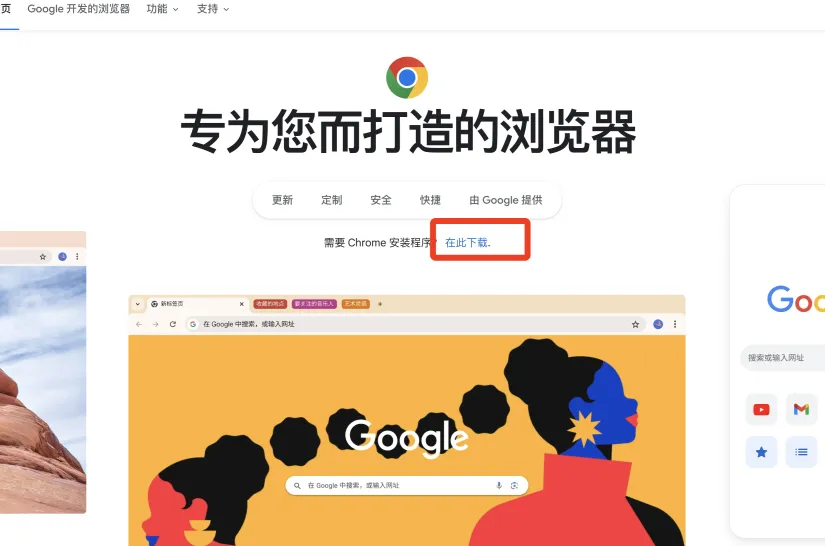
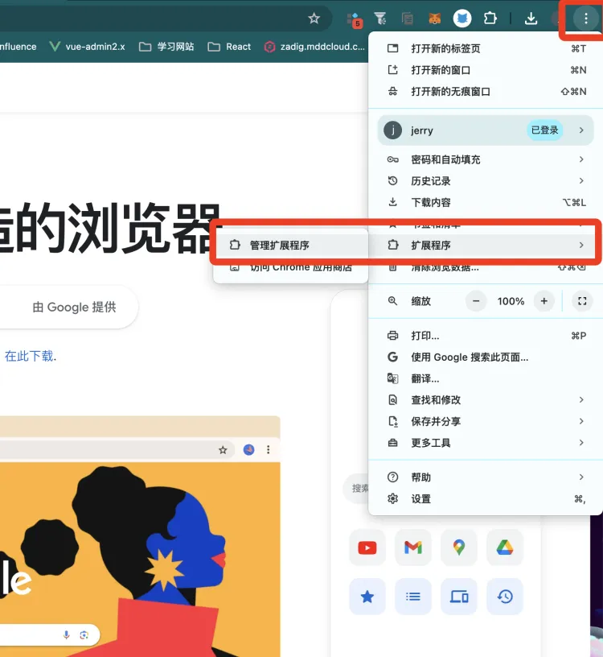
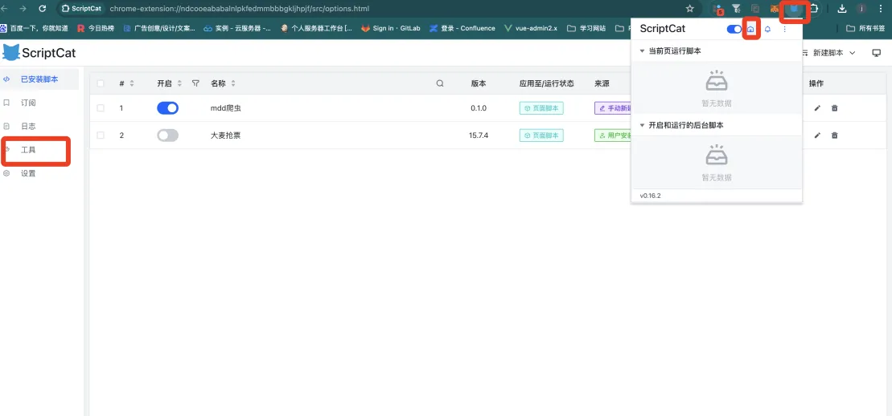
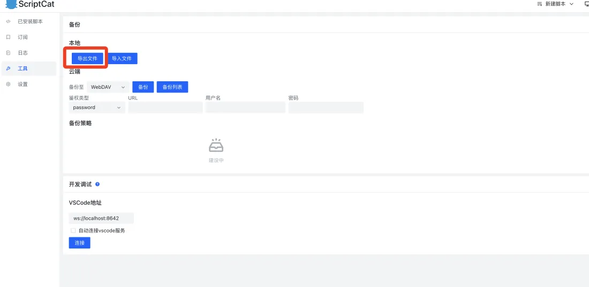
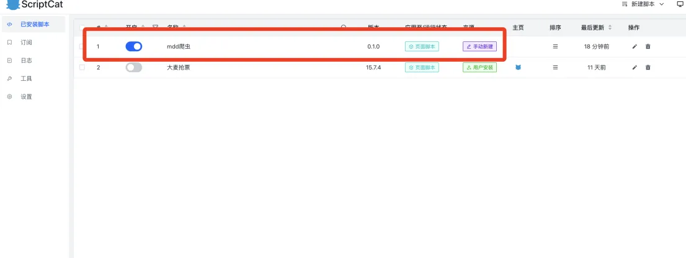
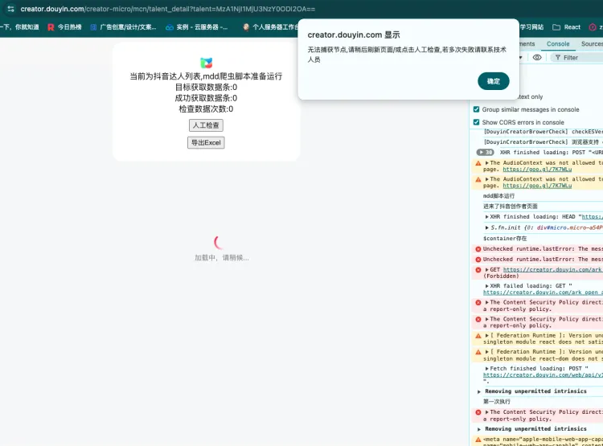

# 抖音视频页爬虫

## 工具准备

1. Chrome 谷歌浏览器
2. Script Cat 脚本工具
3. MDD 爬虫脚本

## 安装方法

### 1. 安装 Chrome 浏览器
[下载 Chrome 浏览器](https://www.google.cn/chrome/)




### 2. 安装 Script Cat 脚本运行工具

- 进入 Chrome 扩展程序管理页面。
- 添加 `Script Cat.crx` 文件（直接拖拽进页面即可）。
- 安装完成后，您将看到 Script Cat 的工具标志。





### 3. 安装 MDD 爬虫脚本

- 点击 Script Cat，进入控制台页面。
- 点击 `工具` 并导入脚本压缩包。
- 在已安装脚本中查看 MDD 爬虫脚本，即表示安装成功。





## 如何使用

1. 进入目标页面后，脚本会自动检测并运行。
2. 脚本会自动在目标页面执行，确保数据的采集。


## 注意事项

1. **页面加载较慢时**：如果数据列表还未完全加载，脚本无法运行。您可以等待页面加载完成后，点击“人工检查”并重新运行脚本。
2. **自动滚动加载更多数据时**：如果页面卡住，脚本会自动检查并尝试继续运行，最多检查 5 次。如果检查次数超过 5 次，您需要手动点击检查按钮以继续运行脚本。
3. **导出 Excel 脚本**：当成功获取的数据条数与目标数据条数一致时，脚本会自动执行导出操作。您也可以手动触发导出。
4. **数据条数不符时**：当实际数据条数与目标条数不符时，脚本会继续检查 5 次。如果 5 次后数据仍然不符，很可能是所有数据已被爬取，只是页面显示的目标数据错误。此时，您需要手动点击导出按钮，以导出当前显示的所有数据。

> 注：当页面加载较慢时，确保数据完全加载后，点击“人工检查”以便重新运行脚本。



## 代码参考
```js
// ==UserScript==
// @name         mdd抖音视频信息爬虫脚本
// @namespace    mdd
// @version      1.0.0
// @description  抖音视频爬虫
// @author       jerryXu
// @grant        unsafeWindow
// @include      https://creator.douyin.com/creator-micro/mcn/*
// @require      https://cdn.staticfile.org/jquery/3.5.1/jquery.min.js
// @require      https://unpkg.com/xlsx/dist/xlsx.full.min.js
// ==/UserScript==


var time; //数据列表用
var listNum = 0;//数据数量
var checkNum = 0;//检查是否获取所有数据次数
var checkLimitNum = 10;//限制检查是否获取所有数据次数
var targetNum = 0;//目标爬取数据数量
var allTargets = [];//目标所有数据
var excelTitle = '模板';//excel名称

const convertWanToNumber = (str) => {
    // 去掉字符串中的空格，匹配数字部分
    const regex = /(\d+(\.\d+)?)\s*万/;
    const match = str.match(regex);

    if (match) {
        // 如果匹配到 '万'，则将数字部分乘以 10000
        const num = parseFloat(match[1]) * 10000;
        return num;
    }

    // 如果没有匹配到 '万'，则返回原始值
    return parseFloat(str);
}
const autoSizeColumns = (ws) => {
    const range = XLSX.utils.decode_range(ws['!ref']); // 获取表格范围
    const columnWidths = [];

    // 遍历每一列
    for (let col = range.s.c; col <= range.e.c; col++) {
        let maxWidth = 0;

        // 遍历每一行
        for (let row = range.s.r; row <= range.e.r; row++) {
            const cell = ws[XLSX.utils.encode_cell({ r: row, c: col })];
            if (cell && cell.v) {
                // 计算最大宽度，考虑空格和数字的字符长度
                maxWidth = Math.max(maxWidth, cell.v.toString().length);
            }
        }
        columnWidths.push({ wch: maxWidth + 10 });  // 添加一些额外的宽度
    }

    // 设置列宽
    ws['!cols'] = columnWidths;
}

var excelCB = () => {
    let wb = XLSX.utils.book_new();

    // 创建工作表的内容数组
    let ws_data = [
        ["账号名称", "标题", "标签", "ID", "日期", "播放次数", "点赞次数", "评论次数", "转发次数"],
        ...allTargets
    ];

    let ws_name = "数据列表";

    // 写入工作表
    let ws = XLSX.utils.aoa_to_sheet(ws_data);

    // 使用自动调整列宽的函数
    autoSizeColumns(ws);

    // 插入工作簿
    XLSX.utils.book_append_sheet(wb, ws, ws_name);

    // 导出Excel文件
    XLSX.writeFile(wb, `${excelTitle}.xlsx`, { bookType: "xlsx" });
};

//测试域名
// const prefix = 'https://testplat.mddcloud.com.cn'
//生产域名
// const prefix = 'https://plat.mddcloud.com.cn'


//获取直播间数据
const getLiveInfo = () => {

    //节点存在
    setTimeout(() => {
        if ($(".item-list   .video-detail-small").length) {

            $("#control_container_content").text('脚本运行中,每3秒更新一次数据');


            excelTitle = $("#sub-app .user-name_0030d")[0].innerText || '模板'
            console.log(excelTitle, 'excelTitle')


            console.log($(".count-wrapper_a5f5c"), '${".count-wrapper_a5f5c"}')

            const result = $(".count-wrapper_a5f5c")[2].innerText
            console.log(result, typeof result, 'result')
            targetNum = Number(result);
            $("#tips2").text(targetNum)


            let targets = $(".item-list   .video-detail-small")
            // console.log(targets, 'targets')
            let liveInfos = []

            targets.each((index, node) => {
                let info = new Array(9)


                info[0] = excelTitle
                info[1] = $(node).find('.detail-auth-wrapper-box .small-detail-title').text()
                info[2] = $(node).find('.detail-auth-wrapper-box .video-small-contest').text()
                info[3] = $(node).find('.detail-auth-wrapper-box .small-detail-id').text().replace(/^ID/, '')
                info[4] = $(node).find('.detail-auth-wrapper-box .samll-detail-uname').text()

                $(node).find('.detail-auth-wrapper-box .small-detail-count-box div').contents().each((_index, _node) => {
                    if (_index < 4) {
                        switch (_index) {
                            case 0:
                                info[5] = convertWanToNumber(_node.innerText)
                                break;
                            case 1:
                                info[6] = convertWanToNumber(_node.innerText)
                                break;
                            case 2:
                                info[7] = convertWanToNumber(_node.innerText)
                                break;
                            case 3:
                                info[8] = convertWanToNumber(_node.innerText)
                                break;
                            default:
                                console.log('节点获取数据有误')
                                break;
                        }
                    }
                })
                liveInfos.push(info)
            })

            allTargets = liveInfos
            console.log(liveInfos.length, '收集数据数量')
            console.log(checkLimitNum, 'checkLimitNum')

            if (listNum !== liveInfos.length) {
                listNum = liveInfos.length
                $("#tips1").text(listNum)
                $(document).scrollTop($(document).height());
                getLiveInfo()
            } else {
                if (targetNum === listNum) {
                    $("#control_container_content").text(`已经爬取目标条数数据,可以导出Excel表格`);
                    excelCB()
                    return
                }
                if (checkNum === checkLimitNum) {
                    $("#control_container_content").text(`检查了${checkLimitNum}次已经获取所有数据了,如没有获取所有数据,再次点击人工检查是否已经获取所有数据`);
                } else {
                    $(document).scrollTop($(document).height());
                    getLiveInfo()
                    checkNum++;
                    console.log(checkNum, '检查次数')
                    $("#tips").text(checkNum)
                }
            }
            // console.log(liveInfos, 'liveInfos')
        } else {
            alert('无法捕获节点,请稍后刷新页面/或点击人工检查,若多次失败请联系技术人员')
        }
    }, 3000)
}


const $liveStyle = $(
    "<style>" +
    "#control_container{background:#fff;padding:0;overflow: hidden;font-size:16px;display:flex;justify-content: center; align-items: center;width:380px;height:240px;position: fixed;top: 10px;left: 50%;z-index: 999;transform: translateX(-50%);border-radius:20px;  flex-direction: column;color:black;}" +
    "#start_btn{color:#fff;background:red;border-radius:5px;}" +
    "</style>"
)


const $control_container = $("<div id='control_container'></div>");
const $icon = $(
    ``
)
// 直播收据脚本UI界面
const liveUi = () => {
    // ice-container
    const $container = $("#micro");
    // if ($container == null || $container.length == 0) {
    //     $container = $(".auto-banner");
    //   }
    if ($container == null || $container.length == 0) {
        setTimeout(liveUi, 200);
        return;
    }
    console.log($container)
    console.log('$container存在')


    const control_container_content_text = '当前为抖音达人列表,mdd爬虫脚本准备运行'

    const $content = $(
        `<div  id="control_container_content" style="padding:0 10px"> ${control_container_content_text}</div>`
    )
    const $tips = $(`<div  id="tipsBox" style="margin-bottom:10px"> 设置检查次数:<span id="tips3">${checkLimitNum}</span> 检查数据次数:<span id="tips">0</span></div>`)
    const $tips1 = $(`<div  id="tipsBox1" > 成功获取数据条:<span id="tips1">0</span></div>`)
    const $tips2 = $(`<div  id="tipsBox2" > 目标获取数据条:<span id="tips2">0</span></div>`)

    const $btn = $(`<button style="margin-bottom:10px;cursor:pointer;">人工检查</button>`)
    const $btn1 = $(`<button style="cursor:pointer">导出Excel</button>`)
    const $btn2 = $(`<button style="cursor:pointer">设置自检次数为100</button>`)

    // 为按钮添加点击事件
    $btn.on('click', function () {
        // 在此处添加点击事件处理逻辑
        checkNum = 0
        getLiveInfo()
    });


    $btn1.on('click', excelCB);
    $btn2.on('click', function () {
        // 在此处添加点击事件处理逻辑
        checkLimitNum = 100
        $("#tips3").text(checkLimitNum)
        console.log(checkLimitNum, 'checkLimitNum')
    });


    $control_container.append($liveStyle);
    $control_container.append($icon);
    $control_container.append($content);
    $control_container.append($tips2);
    $control_container.append($tips1);
    $control_container.append($tips);
    $control_container.append($btn);
    $control_container.append($btn1);
    $control_container.append($btn2);
    $container.append($control_container);
    liveCB()
}

const liveCB = () => {

    setTimeout(() => {
        console.log('第一次执行')
        getLiveInfo()
    }, 20000)
}

//--------------------------------

$(document).ready(function () {

    console.log('mdd脚本运行')
    var curr_url = window.location.href;
    if (curr_url.includes("https://creator.douyin.com/creator-micro/mcn/talent_detail")) { //视频信息爬虫逻辑
        // able-row table-record  
        console.log('进来了抖音创作者页面')
        liveUi()
    }
});
```
