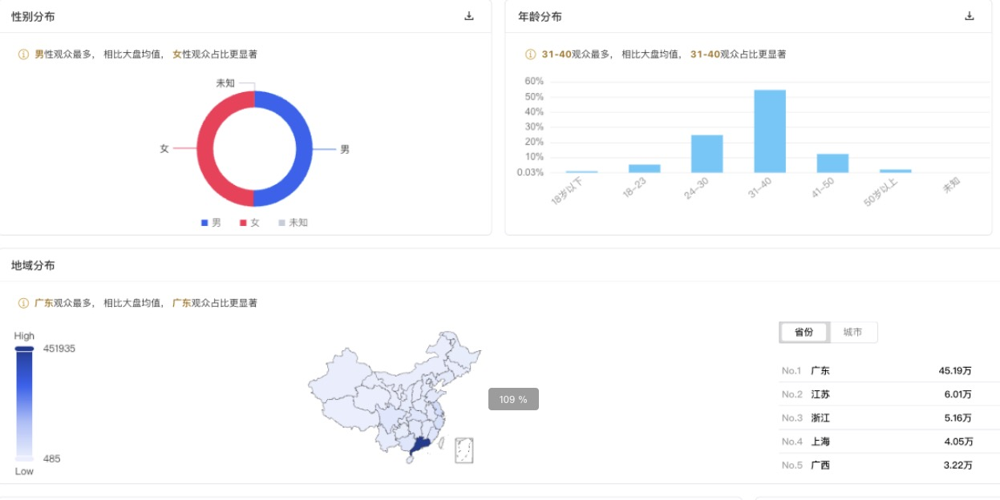

* 特定API数据收集

有时候我们在爬取html页面数据时,有一些数据因为嵌入到canvas图表中我们无法直接通过爬取标签的文本内容,如下图:



这个时候我们就需要去截获该图表的对应接口,拿到想要的数据再进行分析,可以通过下面的方式去获取:

```js
    // 只收集特定API的请求数据
    const targetAPIs = [
        '/api/user',
        '/api/data',
        'graphql'
    ];
    
    const originalOpen = unsafeWindow.XMLHttpRequest.prototype.open;
    
    unsafeWindow.XMLHttpRequest.prototype.open = function(method, url) {
        const isTarget = targetAPIs.some(api => url.includes(api));
        
        if (isTarget) {
            this._isTarget = true;
            this._requestData = {
                method: method,
                url: url,
                timestamp: new Date().toISOString()
            };
            
            // 监听readyState变化
            this.addEventListener('readystatechange', function() {
                if (this.readyState === 4 && this._isTarget) {
                    this._requestData.response = {
                        status: this.status,
                        data: this.responseText
                    };
                    
                    console.log('获取到目标API数据:', this._requestData);
                    
                    // 存储或发送数据
                    storeAPIData(this._requestData);
                }
            });
        }
        
        originalOpen.apply(this, arguments);
    };
    
    function storeAPIData(data) {
        // 这里可以实现数据存储逻辑
        // 例如使用GM_xmlhttpRequest发送到你的服务器
        // 或使用GM_setValue存储在本地
    }
```
