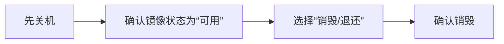
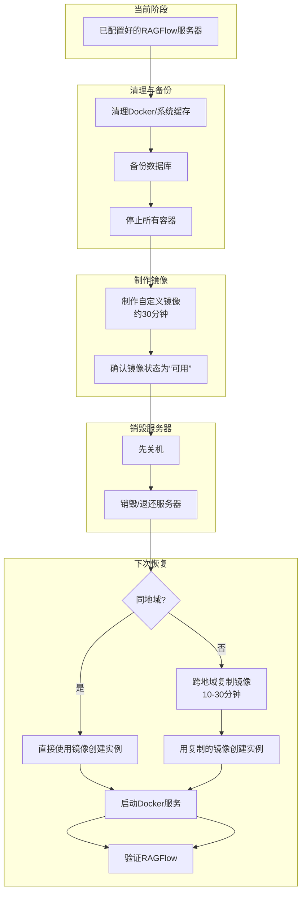

# 服务器容器镜像使用指南

## 一、概述

本文档记录了如何将已配置好的 RAGFlow 服务器（腾讯云）制作成自定义镜像，并在销毁服务器后，利用该镜像快速创建一台环境完全相同的新服务器。这样可以避免重复安装和配置，节省大量时间。

---

## 二、前提条件

| 项目 | 说明 |
|------|------|
| 云服务商 | 腾讯云 |
| 实例状态 | 运行中（支持在线制作镜像）或已关机 |
| 系统盘类型 | 云硬盘（2018年7月后创建的实例默认支持） |
| 镜像地域 | 镜像只能在创建地域使用，跨地域需先复制 |

> **注意**：使用镜像创建新实例时，腾讯云会要求您**重新设置 SSH 登录密码或选择新的密钥对**。请务必将新密码/密钥保存在安全的地方，否则将无法登录服务器。

---

## 三、第一步：清理环境、备份数据并停止服务（制作镜像前）

在制作镜像前，建议执行以下操作，确保数据一致性和镜像体积最小化。

### 3.1 清理 Docker 无用数据

```bash
# 清理 Docker 构建缓存、未使用的镜像、容器和卷
sudo docker system prune -a --volumes
```

### 3.2 清理系统日志和缓存

```bash
# 清理系统日志
sudo journalctl --vacuum-time=3d

# 清理 apt 缓存
sudo apt clean
sudo apt autoclean

# 清理临时文件
sudo rm -rf /tmp/*
sudo rm -rf /var/tmp/*
```

### 3.3 备份数据库（推荐）

```bash
cd /opt/ragflow/docker
source .env
sudo docker exec docker-mysql-1 mysqldump -u root -p${MYSQL_PASSWORD} rag_flow > ragflow_backup_$(date +%Y%m%d).sql
```

### 3.4 停止所有容器（确保数据一致性）

```bash
cd /opt/ragflow/docker
sudo docker compose down

# 确认容器已全部停止
sudo docker ps
```

> **注意**：执行此步骤后，RAGFlow 服务将停止。镜像恢复后需要手动启动服务（见第七步）。

---

## 四、第二步：制作自定义镜像

### 4.1 从实例列表制作（推荐）

1. 登录 [腾讯云控制台](https://console.cloud.tencent.com/cvm)
2. 进入 **云服务器** → **实例**
3. 找到目标实例，点击右侧 **更多** → **镜像** → **制作镜像**


### 4.2 从镜像菜单制作

1. 左侧菜单选择 **镜像** → **自定义镜像**
2. 点击 **创建** → **制作镜像**
3. 选择需要制作镜像的实例

### 4.3 填写镜像信息

| 配置项 | 建议填写内容 |
|--------|-------------|
| 镜像名称 | `ragflow-env-v1` |
| 镜像描述 | `已安装RAGFlow v0.25.6，包含完整Docker部署环境` |
| 仅创建系统盘镜像 | ✅ 勾选（RAGFlow数据都在系统盘） |

点击 **开始制作**，等待约 **30分钟** 完成。

---

## 五、第三步：确认镜像创建成功

1. 左侧菜单选择 **镜像** → **自定义镜像**
2. 查看镜像状态：
    - `创建中` → 正在制作，请等待
    - `可用` → 制作完成，可以正常使用

---

## 六、第四步：销毁/退还服务器

### 6.1 注意事项

| 项目 | 说明 |
|------|------|
| 服务器费用 | 销毁后立即停止计费 |
| 镜像费用 | 50GB镜像在80GB免费额度内，**不收费** |
| 回收站 | 按量计费实例销毁后进入回收站保留2小时，2小时后彻底释放 |
| 数据安全 | 镜像已保存完整环境，销毁原服务器不影响后续恢复 |

### 6.2 销毁步骤



**强烈建议**：先点击**关机**，待实例完全停止后再选择**销毁/退还**，确保数据已完整落盘。

---

## 七、第五步：下次使用镜像创建新服务器

### 7.1 从镜像创建实例（两种方式任选）

**方式一：从镜像列表创建（推荐）**

1. 控制台 → **镜像** → **自定义镜像**
2. 找到 `ragflow-env-v1`，点击 **创建实例**

**方式二：从购买页创建**

1. 进入云服务器购买页 → 选择**自定义配置**
2. 在**镜像**步骤 → 选择**自定义镜像** → 选中 `ragflow-env-v1`

### 7.2 新服务器配置说明

| 配置项 | 是否必须与原来一致 | 说明 |
|--------|------------------|------|
| 操作系统 | ✅ 必须一致 | 镜像已固定，无法更改 |
| 已安装软件 | ✅ 必须一致 | 镜像已固定 |
| 地域 | ⚠️ 建议一致 | 镜像只能在同地域使用，跨地域需先复制 |
| 实例规格 | ❌ 可灵活调整 | 可升级或降级（CPU/内存） |
| 硬盘大小 | ❌ 可调整 | 可选更大的系统盘 |
| 计费模式 | ❌ 可调整 | 按量计费/包年包月均可 |
| 带宽/网络 | ❌ 可调整 | 按需选择 |

### 7.3 新服务器创建后启动 RAGFlow

由于制作镜像前我们执行了 `docker compose down`，新服务器恢复后需要手动启动 RAGFlow 服务：

```bash
# 登录新服务器后执行
cd /opt/ragflow/docker
sudo docker compose up -d

# 等待服务启动
sleep 30

# 验证服务状态
sudo docker ps
```

### 7.4 创建完成后检查项

新实例创建后，建议执行以下检查：

- [ ] 所有软件和配置（Docker、RAGFlow、知识库数据）完整保留
- [ ] 公网 IP 已变更，更新访问地址
- [ ] 检查 RAGFlow 配置：确认 `.env` 文件中没有硬编码的旧 IP 地址
- [ ] 检查系统设置：登录 RAGFlow Web 界面，在“系统设置”中检查所有回调 URL 是否已更新为新 IP
- [ ] 测试 RAGFlow 访问：`http://新服务器IP`
- [ ] 测试聊天功能是否正常

---

## 八、跨地域使用镜像

如果下次需要在**其他地域**（如从广州换到上海）创建服务器：

1. 进入 **镜像** → **自定义镜像**
2. 找到 `ragflow-env-v1`，点击 **跨地域复制**
3. 选择目标地域，点击确定
4. 等待复制完成（约10-30分钟）
5. 在目标地域的镜像列表中，用复制后的镜像创建实例

> **注意**：跨地域复制会产生少量流量费。

---

## 九、费用说明

| 项目 | 费用情况 |
|------|---------|
| 原服务器实例 | 销毁后立即停止计费 |
| 自定义镜像存储 | 80GB免费额度，50GB镜像**不收费** |
| 跨地域复制镜像 | 产生少量流量费 |
| 新服务器实例 | 正常按所选配置计费 |

---

## 十、操作流程图



---

## 十一、常见问题

### Q1：服务器运行中可以直接制作镜像吗？

**可以**。2018年7月后创建的云硬盘实例支持在线制作镜像，无需关机。如果制作失败，控制台会提示关机后重试。

### Q2：销毁服务器后镜像还在吗？

**在**。镜像是独立存储的，销毁实例不影响已创建的自定义镜像。

### Q3：用镜像创建的新服务器需要重新配置什么？

基本上**无需重新配置**。唯一需要注意的是：
- 新的公网IP地址变了
- 需要手动启动 RAGFlow 服务（`docker compose up -d`）
- 如果 RAGFlow 配置中写死了旧IP，需要相应更新

### Q4：镜像可以分享给其他人吗？

**可以**。腾讯云支持共享镜像给其他腾讯云账号，但不支持跨账号跨地域。

### Q5：知识库数据会被保存在镜像中吗？

**会**。数据库（MySQL）和向量数据库（Elasticsearch）的数据都存储在系统盘中，会被镜像一起打包保存。

### Q6：忘记新服务器的 SSH 密码怎么办？

**注意**：使用镜像创建新实例时，腾讯云会要求您**重新设置 SSH 登录密码或选择新的密钥对**。请务必将新密码/密钥保存在安全的地方。如果忘记，可以通过腾讯云控制台重置密码。

### Q7：镜像恢复后 RAGFlow 访问异常怎么办？

**排查步骤**：
1. 确认容器已启动：`sudo docker ps`
2. 查看容器日志：`sudo docker logs docker-ragflow-cpu-1 --tail 50`
3. 检查防火墙和安全组是否放行 80 端口
4. 检查 RAGFlow 配置中是否有硬编码的旧 IP

---

## 十二、相关命令速查

```bash
# 查看服务器内存
free -h

# 查看 Docker 容器状态
sudo docker ps

# 查看 RAGFlow 容器日志
sudo docker logs docker-ragflow-cpu-1 --tail 50

# 备份数据库（从 .env 读取密码）
cd /opt/ragflow/docker
source .env
sudo docker exec docker-mysql-1 mysqldump -u root -p${MYSQL_PASSWORD} rag_flow > ragflow_backup_$(date +%Y%m%d).sql

# 停止所有服务
cd /opt/ragflow/docker
sudo docker compose down

# 启动所有服务
sudo docker compose up -d

# 清理 Docker 无用数据
sudo docker system prune -a --volumes

# 重启 RAGFlow 服务
sudo docker compose restart

# 进入 RAGFlow 容器
sudo docker exec -it docker-ragflow-cpu-1 bash
```

---

## 十三、完整操作流程速查表

| 步骤 | 操作 | 耗时 |
|------|------|------|
| 1 | 清理 Docker 缓存和系统日志 | 2-5分钟 |
| 2 | 备份数据库 | 1分钟 |
| 3 | 停止 Docker 容器 | 30秒 |
| 4 | 腾讯云控制台制作镜像 | 约30分钟 |
| 5 | 确认镜像状态为“可用” | - |
| 6 | 销毁原服务器 | 1分钟 |
| **下次恢复** | | |
| 7 | 用镜像创建新实例 | 5-10分钟 |
| 8 | 登录新服务器，启动 Docker 服务 | 1分钟 |
| 9 | 启动 RAGFlow（`docker compose up -d`） | 1分钟 |
| 10 | 验证服务正常 | 1分钟 |

